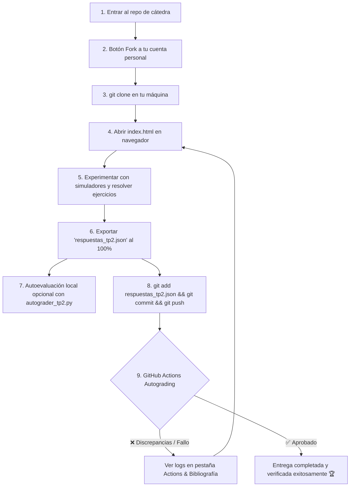

# 📚 Guía de Estudio y TP N° 2: Administración de Procesos, Hilos y Planificación de CPU
### Cátedra: Teoría de Sistemas Operativos (TSO) — Ciclo Lectivo 2026
**Universidad Nacional de Jujuy (UNJu) — Facultad de Ingeniería**  
**Docente Responsable:** Ing. María Fernanda Vázquez  
**Jefatura de Trabajos Prácticos:** Ing. Fabio D. Argañaraz  

[](https://github.com/UNJU-Teoria-de-Sistemas-Operativos/TP2/actions/workflows/classroom.yml)

---

## 📂 Estructura del Repositorio

```text
TP2/
├── .github/
│   └── workflows/
│       └── classroom.yml      # Workflow de GitHub Actions (Autograding CI disparado por push del alumno)
├── index.html                 # Aplicación web interactiva con simuladores embebidos
├── styles.css                 # Diseño visual Glassmorphism Dark/Light
├── app.js                     # Motor interactivo de ejercicios, simuladores y exportación JSON
├── rubric_tp2.json            # Rúbrica pública protegida con hashes criptográficos SHA-256
├── autograder_tp2.py          # Script de evaluación automática (consola, --json y GitHub Summary)
├── README.md                  # Guía de estudio, mapa bibliográfico y tutorial Git/Actions
└── .gitignore                 # Reglas de exclusión para Git
```

---

## 🎯 Objetivos de Aprendizaje
1. Comprender la estructura y **organización de la memoria de un proceso** en sus cuatro segmentos fundamentales: Código (*Text*), Datos (*Data/BSS*), Memoria Dinámica (*Heap*) y Pila de Ejecución (*Stack*).
2. Distinguir rigurosamente entre un **Programa** (entidad pasiva en almacenamiento secundario) y un **Proceso** (entidad activa en ejecución con PID, contexto y recursos).
3. Analizar la evolución y limitaciones de los **Modelos de Estados**: desde el modelo elemental de 2 estados hasta los modelos de 3 y 5 estados.
4. Explorar de forma interactiva el **Modelo de 7 Estados**, comprendiendo el rol del almacenamiento secundario (*Swapping*) y las transiciones entre estados activos e inactivos (*Listo Suspendido* y *Bloqueado Suspendido*).
5. Describir la anatomía del **Bloque de Control de Procesos (BCP / PCB)**, su rol en el **Cambio de Contexto** (*Context Switch*) y su diferenciación con el Bloque de Control del Sistema (BCS).
6. Analizar las operaciones esenciales de procesos en sistemas POSIX: duplicación mediante `fork()`, mutación de imagen mediante `exec()`, y la gestión de fenómenos anómalos como procesos **Zombies** y procesos **Huérfanos** adoptados por `init`/`systemd`.
7. Comparar la arquitectura de **Hilos de Ejecución (*Threads / LWP*) vs. Procesos**, identificando recursos compartidos y recursos privados exclusivos de cada hilo.
8. Examinar los mecanismos de **Comunicación entre Procesos (IPC)**: Memoria Compartida (*Shared Memory*) vs. Paso de Mensajes (*Pipes*, *FIFOs*, *Sockets*), evaluando su rendimiento y requerimientos de sincronización.
9. Diferenciar los tres niveles de planificación: **Largo Plazo** (*Job Scheduler*), **Medio Plazo** (*Swapper*) y **Corto Plazo** (*CPU Scheduler / Dispatcher*), junto a los criterios de rendimiento (*Throughput, Turnaround, Waiting Time, Response Time*).
10. Simular de manera visual mediante **Diagramas de Gantt** dinámicos los algoritmos de planificación de CPU: **FCFS**, **SJF** y **Round Robin**, comprendiendo el Efecto Convoy y la técnica de Envejecimiento (*Aging*) contra la inanición.

---

## 📖 Mapa Bibliográfico por Capítulo y Tema

Para resolver este trabajo práctico disponen de la bibliografía oficial provista por la cátedra en el **Aula Virtual** y las diapositivas dictadas por la profesora titular ([Clase 3 - Unidad 4 y 5.pdf](file:///c:/Universidad/Teor%C3%ADa%20de%20los%20Sistemas%20Operativos/Clase%202/Clase%203%20-%20Unidad%204%20y%205.pdf)):

| Tema del TP | Diapositivas de Cátedra | Silberschatz (7ma Ed.) | Carretero et al. | Stallings | Tanenbaum |
| :--- | :--- | :--- | :--- | :--- | :--- |
| **Concepto de Proceso y Memoria (Text, Data, Heap, Stack)** | `U4` (Slides 2, 3, 4, 5) | **Capítulo 3:** Sec. 3.1 | **Capítulo 3:** Sec. 3.1 | **Capítulo 3:** Sec. 3.1 | **Capítulo 2:** Sec. 2.1 |
| **Programa vs. Proceso (Pasivo / Activo)** | `U4` (Slides 3, 6) | **Capítulo 3:** Sec. 3.1 | **Capítulo 3:** Sec. 3.1 | **Capítulo 3:** Sec. 3.1 | **Capítulo 2:** Sec. 2.1 |
| **Modelos de 2, 3 y 5 Estados** | `U4` (Slides 7, 8, 9) | **Capítulo 3:** Sec. 3.1 | **Capítulo 3:** Sec. 3.2 | **Capítulo 3:** Sec. 3.2 | **Capítulo 2:** Sec. 2.1 |
| **Modelo de 7 Estados & Swapping** | `U4` (Slides 10, 11) | **Capítulo 3:** Sec. 3.2 | **Capítulo 3:** Sec. 3.2 | **Capítulo 3:** Sec. 3.2 | **Capítulo 2:** Sec. 2.1 |
| **BCP / PCB, BCS y Cambio de Contexto** | `U4` (Slide 13) | **Capítulo 3:** Sec. 3.1 | **Capítulo 3:** Sec. 3.2 | **Capítulo 3:** Sec. 3.3 | **Capítulo 2:** Sec. 2.1 |
| **Operaciones POSIX: fork, exec, Zombies y Huérfanos** | `U4` (Slides 14, 15) | **Capítulo 3:** Sec. 3.3 | **Capítulo 3:** Sec. 3.3 | **Capítulo 3:** Sec. 3.4 | **Capítulo 2:** Sec. 2.1 |
| **Hilos (Threads) vs. Procesos** | `U4` (Slides 17, 18) | **Capítulo 4:** Sec. 4.1 - 4.2 | **Capítulo 3:** Sec. 3.5 | **Capítulo 4:** Sec. 4.1 - 4.2 | **Capítulo 2:** Sec. 2.2 |
| **Comunicación entre Procesos (IPC)** | `U4` (Slides 16, 19) | **Capítulo 3:** Sec. 3.4 - 3.6 | **Capítulo 3:** Sec. 3.4 | **Capítulo 3:** Sec. 3.5 | **Capítulo 2:** Sec. 2.3 |
| **Niveles y Criterios de Planificación** | `U5` (Slides 12, 21, 22, 23) | **Capítulo 5:** Sec. 5.1 - 5.2 | **Capítulo 4:** Sec. 4.1 - 4.2 | **Capítulo 9:** Sec. 9.1 | **Capítulo 2:** Sec. 2.4 |
| **Algoritmos de CPU (FCFS, SJF, RR) & Gantt** | `U5` (Slides 24, 25, 28) | **Capítulo 5:** Sec. 5.3 | **Capítulo 4:** Sec. 4.3 | **Capítulo 9:** Sec. 9.2 | **Capítulo 2:** Sec. 2.4 |

---

## 🚀 Flujo de Trabajo con Git y GitHub (Fork & Clone)

La modalidad de resolución y entrega es **estrictamente individual**:



### Paso 1: Hacer Fork del Repositorio
1. Ingresa a: [**github.com/UNJU-Teoria-de-Sistemas-Operativos/TP2**](https://github.com/UNJU-Teoria-de-Sistemas-Operativos/TP2)
2. Haz clic en el botón superior derecho **"Fork"** y luego en **"Create fork"** para generar una copia en tu cuenta de GitHub.

### Paso 2: Clonar tu Repositorio Fork
Abre tu terminal (Git Bash, PowerShell o Linux Terminal) y descarga tu copia en tu computadora:

```bash
git clone https://github.com/TU_USUARIO/TP2.git
cd TP2
```

### Paso 3: Resolver los Ejercicios en la Web Interactiva
1. Abre el archivo `index.html` en tu navegador web preferido (Google Chrome, Edge, Firefox, Brave).
2. Completa tus datos en el encabezado: **Nombre, Apellido, DNI/Legajo, Carrera y Usuario de GitHub**.
3. Utiliza los simuladores embebidos:
   - **Simulador A (Máquina de 7 Estados)**: Dispara eventos para observar los cambios en el autómata SVG y el PCB.
   - **Simulador B (Planificador de CPU)**: Experimenta con FCFS, SJF y Round Robin para analizar el Diagrama de Gantt.
4. Resuelve los 10 ejercicios interactivos. Tu progreso se guardará automáticamente en el navegador (`localStorage`).

### Paso 4: Exportar el Archivo de Respuestas
Al completar el 100%, pulsa el botón **"💾 Exportar Respuestas (.json)"**. Se descargará el archivo `respuestas_tp2.json`.

> [!IMPORTANT]
> Guarda o copia el archivo `respuestas_tp2.json` en la raíz de la carpeta de tu repositorio clonado `TP2/`.

### Paso 5: Autoevaluación Local (Opcional)
Antes de entregar, si tienes Python 3 instalado, puedes verificar tu calificación ejecutando el autoevaluador de consola:

```bash
python autograder_tp2.py respuestas_tp2.json
```

Si deseas la salida estructurada en JSON:
```bash
python autograder_tp2.py respuestas_tp2.json --json
```

### Paso 6: Guardar Cambios y Subir a GitHub (Git Push)
En tu terminal dentro de la carpeta `TP2/`, ejecuta:

```bash
git add respuestas_tp2.json
git commit -m "Entrega TP2 - [Tu Nombre y Apellido]"
git push origin main
```

### Paso 7: Autoevaluación Automática en GitHub Actions (Verificación Inmediata)
Al igual que en las actividades de **Sistemas Operativos II**, este repositorio cuenta con evaluación automática en la nube:
1. Al hacer `git push origin main`, GitHub disparará automáticamente la Action **Autograding Tests - TP2**.
2. En la lista de commits de tu repositorio o en la pestaña **Actions**, observarás de inmediato el resultado:
   - `✅ (Check verde)`: Tu trabajo práctico está aprobado y la solución es correcta.
   - `❌ (Cruz roja)`: Se detectaron discrepancias conceptuales o no se encontró el archivo `respuestas_tp2.json`.
3. **¿Qué hacer si ves una cruz roja?**
   - Haz clic en la cruz roja o ve a la pestaña **Actions** y abre la ejecución de la prueba.
   - Allí encontrarás el resumen detallado en Markdown con los ejercicios con discrepancia y las páginas exactas de los libros de cátedra para repasar.
   - Ajusta tus respuestas en `index.html`, vuelve a exportar `respuestas_tp2.json`, y realiza un nuevo `git push origin main`.


---

## 👥 Equipo Docente
- **Profesora Titular:** Ing. María Fernanda Vázquez
- **Jefe de Trabajos Prácticos:** Ing. Fabio D. Argañaraz
- **Cátedra:** Teoría de Sistemas Operativos (TSO) — Facultad de Ingeniería, UNJu
